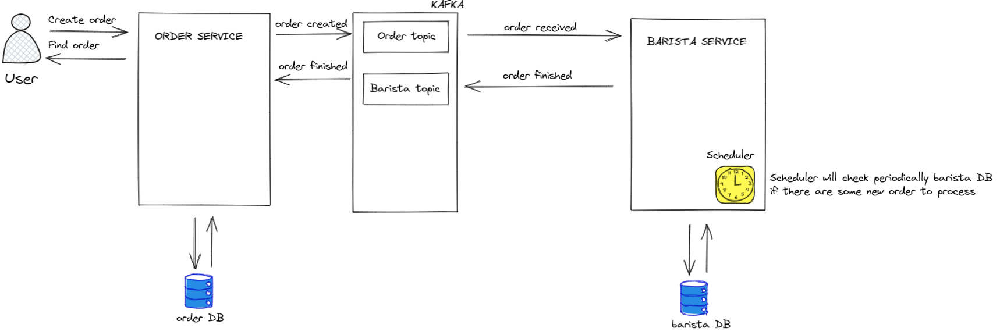

# Drink ordering system
## Architecture overview

Highly decoupled and scalable services with DDD, CQRS and Event Driven Design

### Order Service
Responsible for placing and retrieving orders

### Barista Service
Responsible for order processing

### Notification Service `TODO`
Responsible for sending user notifications  
Will subscribe to barista topic for the finished orders and will send notifications

### Infrastructure
#### Kafka message broker
Will be used for the communication layer between services  
System will start with 3 kafka brokers and each topic will have 3 partitions

#### Zookeeper

#### Schema-registry
Will use avro schema for the kafka messages

#### Kafka init
Will initialize kafka topic

#### Postgresql
Each service will keep internal state into DB

## Installation 
### Prerequisites
- docker version `20.10.17`
- docker Compose version `v2.10.2`
- java version  `openjdk 17.0.2 2022-01-18`
- maven version `Apache Maven 3.6.3`

### Run infrastructure
- create local volumes with required permissions and spin of kafka, zookeeper, schema-registry and postgres
```
./bin/run-infra.sh
```
- recreate kafka topics
```
./bin/run-kafka_recreate_topics.sh
```
- build service images, this will build and create docker images for order-service and barista-service
```
mvn clean install
```
- run order services, this will run previously created service docker images
```
./bin/run-service.sh
```
### Send some requests
You can send some requests
- create order
```
curl --location --request POST 'http://localhost:8181/orders' \
--header 'Content-Type: application/json' \
--data-raw '{
    "drinkType": "COFFEE",
    "drinkAdditions": [
        "MILK",
        "SUGAR"
    ]
}'
```
After order creation you can check barista.orders table to see when the order will be finished  
Barista service has a scheduler and it will check every 5s for the orders to process
- find order
```
curl --location --request GET 'http://localhost:8181/orders/7c872b0c-f142-4978-8cf5-c1a7035f028f'
```

Services are logging events, so you can monitor how the messages are propagated between service
```
docker ps
docker logs <containerId> -f
```
You can also check postgres DB, barista and order schemas
```
host: localhost
port: 5432
user: postgres
password: admin
```

### Run/Debug services via Intelij
You can run/debug services via Intelij by using `local` for active profiles  
To run services locally, first run infrastructure
### TODO
- Add tests
- Check some corner cases
- Implement notification service